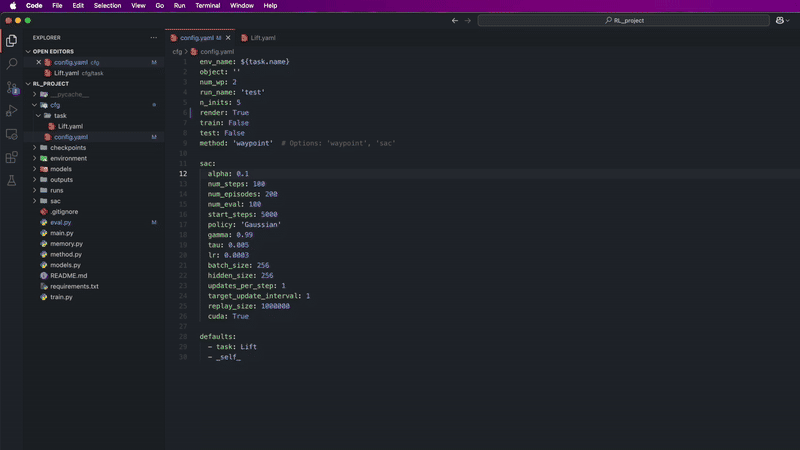

# Waypoint-Based Reinforcement Learning for Robot Manipulation

This repository implements a waypoint-based reinforcement learning approach, a Soft Actor-Critic (SAC) baseline, as described in the paper "Waypoint-Based Reinforcement Learning for Robot Manipulation Tasks" by Mehta et al. The implementation uses TensorFlow and is designed to work with the robosuite simulation environment.


Here's a demonstration of the robot performing the "pick and place" task:



## Usage

### Training

1. **Configure the task and method**: Edit `cfg/config.yaml` to set the task, method, and parameters. For example, to train the waypoint-based method on the Lift task:

   ```yaml
   env_name: Lift
   object: ''
   num_wp: 2
   run_name: 'test'
   n_inits: 5
   render: False
   train: True
   test: False
   method: 'waypoint'
   ```

   For SAC:

   ```yaml
   method: 'sac'
   train: True
   test: False
   ```

2. **Run the training**:

   ```bash
   python main.py
   ```

   This will train the specified method, saving models and training data to `models/{env}/{run_name}/` or `models/{env}/{object}/{run_name}/`.

3. **Monitor training**: Training progress is logged to TensorBoard. View the logs using:

   ```bash
   tensorboard --logdir runs/
   ```

   Open the provided URL (usually `http://localhost:6006`) in a browser.

### Evaluation

1. **Configure evaluation**: Update `cfg/config.yaml` to enable evaluation:

   ```yaml
   train: False
   test: True
   method: 'waypoint'  # or 'sac'
   ```

2. **Run the evaluation**:

   ```bash
   python main.py
   ```

   This will evaluate the trained model, saving results to `models/{env}/{run_name}/eval_data.pkl` (waypoint) or `eval_reward.pkl` (SAC).